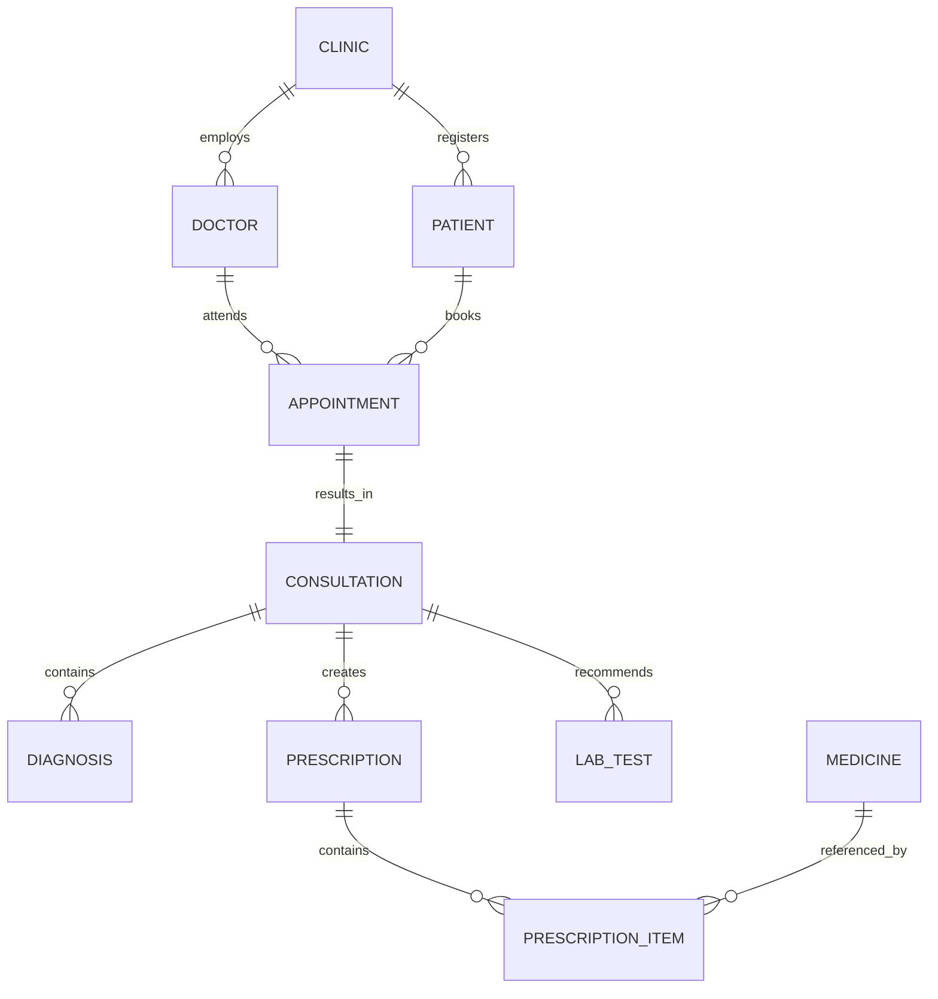

# 11.03 - Complete ER Diagram

> The ER Diagram is not a database drawing.
>
> It is a visual representation of how the business works.

---

# Objective

At this point we have already identified

- Business Entities
- Business Responsibilities
- Business Relationships

Now we combine everything into one visual model.

This diagram becomes the blueprint for

- Database Schema
- Prisma Models
- Repositories
- Services
- API Design

Every future implementation should follow this document.

---

# Business Domains

Instead of looking at one large diagram, divide the system into logical business domains.

```
Clinic Management

↓

Medical Records

↓

Scheduling

↓

Master Data
```

Thinking in domains makes large systems easier to understand.

---

# Domain 1 — Clinic Management

Responsible for

- Clinics
- Doctors
- Patients

```
Clinic

├── Doctors

└── Patients
```

---

# Domain 2 — Scheduling

Responsible for

- Appointments

Appointments connect

- Doctors
- Patients

```
Doctor

↓

Appointment

↑

Patient
```

---

# Domain 3 — Medical Records

Responsible for

- Consultation
- Diagnosis
- Prescription
- Lab Tests

```
Appointment

↓

Consultation

├── Diagnosis

├── Prescription

└── Lab Tests
```

---

# Domain 4 — Master Data

Responsible for reusable information.

```
Medicine
```

Medicines exist independently.

Doctors reference them while prescribing.

---

# Complete Business Flow

Understanding the patient journey explains the entire backend.

```
Patient Registration

↓

Appointment Booking

↓

Doctor Consultation

↓

Diagnosis

↓

Prescription

↓

Lab Test Recommendation

↓

Future Visit

↓

Previous Medical History
```

Everything we build later supports this workflow.

---

# Complete ER Diagram (Business View)

```text
                           ┌──────────────────┐
                           │      Clinic      │
                           └────────┬─────────┘
                                    │
                 ┌──────────────────┴──────────────────┐
                 │                                     │
                 │                                     │
        ┌────────▼────────┐                  ┌────────▼────────┐
        │     Doctor      │                  │     Patient      │
        └────────┬────────┘                  └────────┬────────┘
                 │                                    │
                 └──────────────┬─────────────────────┘
                                │
                        ┌───────▼────────┐
                        │  Appointment    │
                        └───────┬─────────┘
                                │
                        ┌───────▼─────────┐
                        │  Consultation    │
                        └───────┬──────────┘
             ┌──────────────────┼────────────────────┐
             │                  │                    │
             │                  │                    │
      ┌──────▼──────┐   ┌──────▼────────┐   ┌────────▼────────┐
      │ Diagnosis   │   │ Prescription  │   │    Lab Test     │
      └─────────────┘   └──────┬────────┘   └─────────────────┘
                               │
                     ┌─────────▼──────────┐
                     │ Prescription Item   │
                     └─────────┬──────────┘
                               │
                     ┌─────────▼──────────┐
                     │     Medicine        │
                     └────────────────────┘
```

---

# Mermaid ER Diagram



---

# Reading the Diagram

Start from the top.

```
Clinic
```

Everything belongs to a clinic.

Next

```
Doctor

Patient
```

These are the primary actors.

Then

```
Appointment
```

This connects

Doctor

and

Patient.

Once the appointment happens,

the doctor creates

```
Consultation
```

The consultation becomes the central medical record.

Everything medical grows from it.

---

# Why Consultation Is the Center

Notice something.

Diagnosis

Prescription

Lab Tests

all belong to

```
Consultation
```

Why?

Because doctors make all medical decisions during the consultation.

If Consultation did not exist,

the database would lose important context.

Example

```
Prescription

↓

Why was it prescribed?
```

Answer

```
Consultation
```

---

# Why Appointment Exists

A common beginner design is

```
Doctor

↓

Patient

↓

Consultation
```

This ignores scheduling.

The business needs to know

- booked appointments
- cancelled appointments
- missed appointments
- future appointments

Those are scheduling concerns.

Appointment exists for scheduling.

Consultation exists for medical treatment.

---

# Why Prescription Needs PrescriptionItem

Suppose a doctor prescribes

```
Paracetamol

Vitamin C

Ibuprofen
```

Storing these inside one JSON column seems simple.

But later the business asks

```
How many times was
Paracetamol prescribed this month?
```

JSON makes this difficult.

Normalization solves it.

```
Prescription

↓

Prescription Item

↓

Medicine
```

---

# Why Medicine Is Independent

Medicine is master data.

Doctors do not create medicines.

Doctors reference medicines.

This prevents

- duplicate names
- inconsistent spellings
- reporting problems

---

# Engineering Note

Master data should be created once and referenced many times.

Examples include

- Medicines
- Departments
- Countries
- Blood Groups

Avoid duplicating this information across records.

---

# What the Diagram Does NOT Show

The ER diagram intentionally hides

- Indexes
- UUIDs
- Timestamps
- Soft Deletes
- Constraints
- ORM details

Those belong to later chapters.

This diagram focuses only on business structure.

---

# How This Diagram Maps to Code

Every entity becomes

```
Prisma Model
```

Every model becomes

```
Repository
```

Every repository becomes

```
Service Dependency
```

Example

```
Consultation

↓

consultation.model

↓

consultation.repository.ts

↓

consultation.service.ts

↓

consultation.controller.ts
```

The architecture flows naturally from the diagram.

---

# Senior Engineer Review

Before approving an ER diagram, ask

- Can I explain the business by reading this diagram?
- Does every relationship have a business reason?
- Is there any duplicated relationship?
- Is any entity trying to do too much?
- Can every API we plan to build be supported by this model?
- Does this design still make sense if we switch from PostgreSQL to MongoDB?

If the answer is "Yes",

the model is likely well designed.

---

# Summary

The ER Diagram is the blueprint of the application.

It captures the business, not the technology.

Every table, repository, service, and API we implement later should be traceable back to this model.

When the business changes, the ER diagram changes first.

The database and code follow afterward.

---

# Next Chapter

The next chapter covers **Primary Keys & Foreign Keys**.

We will move from business relationships to database implementation and answer questions such as

- Why UUID instead of auto-increment?
- Which tables own foreign keys?
- Which relationships should cascade?
- How do keys affect scalability and security?
